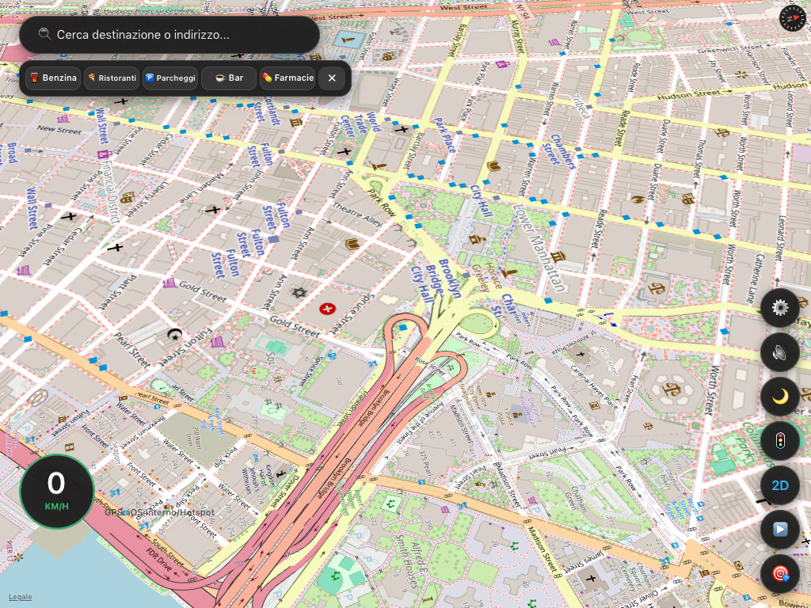
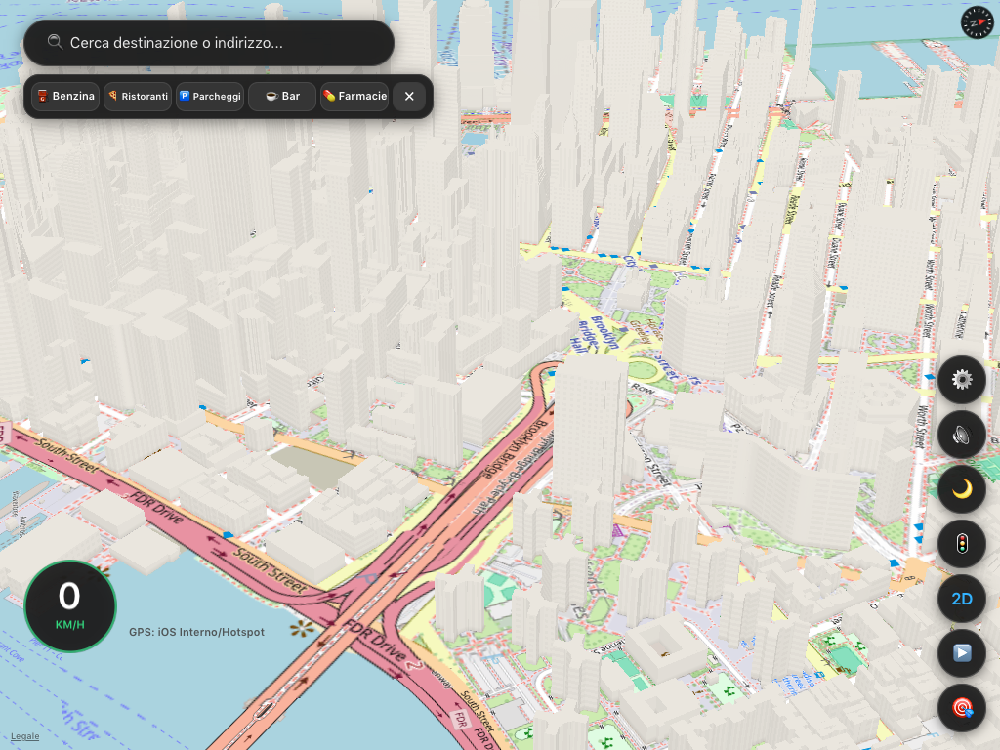
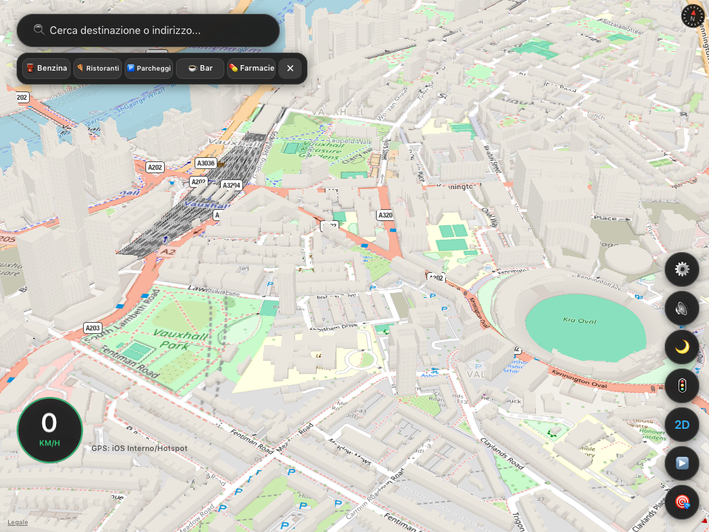
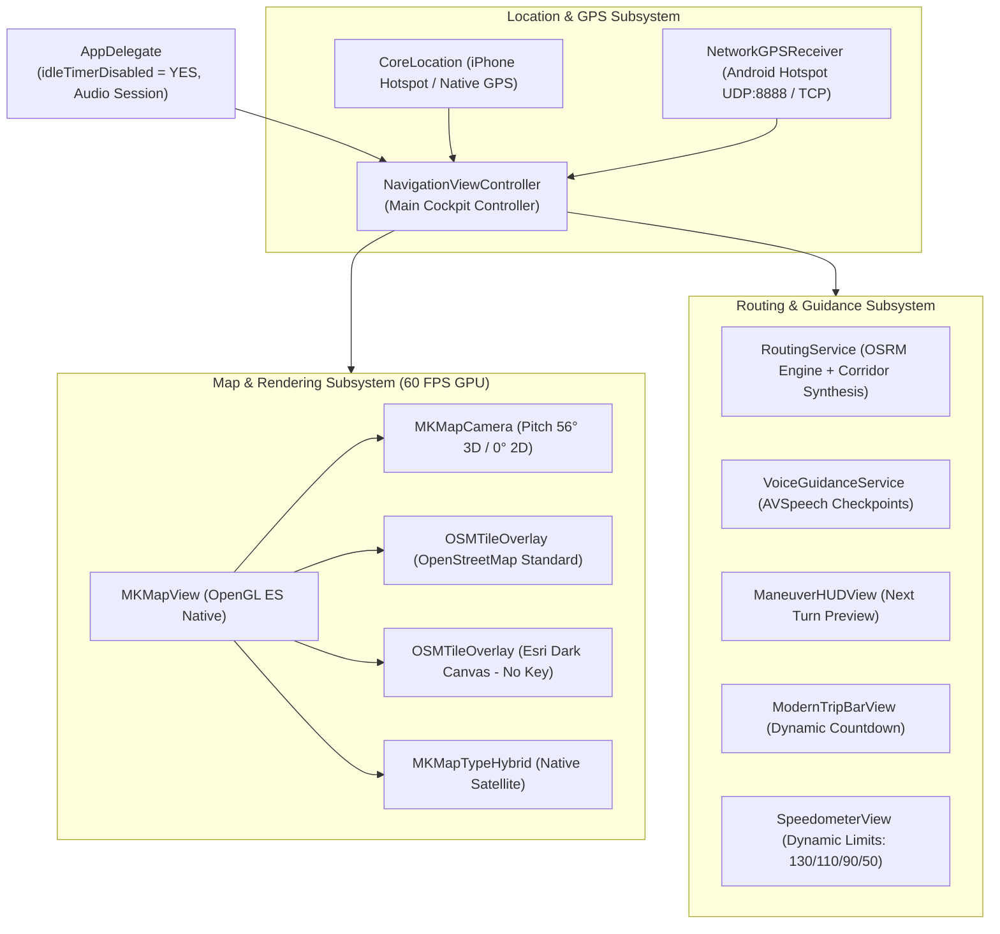

# 🗺️ NavigatorOSM: In-Car GPS Navigator for Legacy iPads (iOS 9.3.5 / 32-bit armv7)

[](https://github.com/vibe-maribit/NavigatorOSM/releases)
[](https://github.com/vibe-maribit/NavigatorOSM/releases)
[](https://github.com/vibe-maribit/NavigatorOSM)
[](https://openstreetmap.org)
[](https://github.com/vibe-maribit/NavigatorOSM)
[](LICENSE)

> **Don't let your obsolete iPad become electronic waste.**  
> **NavigatorOSM** gives a second life to legacy iPad tablets (iPad Mini 1, iPad 2, iPad 3, iPad 4) running iOS 9.3.5, repurposing them into dedicated, fluid, high-performance in-car GPS navigators inspired by **Google Maps & Waze**.

---

## 📸 Real iPad Mini 1 Screenshots (iOS 9.3.5)

| 🏎️ 3D Cockpit, Speedometer & POI Shelf | 🏙️ 3D Buildings & Flyover Architecture | 🇬🇧 High-Density City Navigation |
| :---: | :---: | :---: |
| <a href="assets/screenshots/screenshot1.png"></a> | <a href="assets/screenshots/screenshot2.png"></a> | <a href="assets/screenshots/screenshot3.png"></a> |

*Actual captures running natively at 60 FPS on Apple A5 silicon (iPad Mini 1st Gen, iOS 9.3.5).*

---

## 💡 The Project Mission: Smart iPad Retrofitting

Millions of legacy Apple tablets—especially the **iPad Mini 1st Gen (A1432 / MD528TY/A)** with the **Apple A5 chip (dual-core 1.0 GHz Cortex-A9, 512 MB RAM)**—are currently sitting unused in drawers because modern iOS apps (Google Maps, Waze, Apple Maps) no longer support iOS 9, and the modern web crashes the browser due to RAM exhaustion.

**NavigatorOSM solves this with a 100% Pure Native Objective-C Architecture:**
- **Zero WebKit / Zero Browser**: Unlike web wrappers that crash due to iOS 9 `jetsam` memory limits, NavigatorOSM consumes **less than 25 MB of RAM** (< 5% of total system memory).
- **60 FPS Hardware-Accelerated Rendering**: Leverages the Apple PowerVR SGX543MP2 GPU directly through MapKit and OpenGL ES pipelines for butter-smooth zooming, panning, and tilting.
- **Zero API Keys Required**: Seamlessly runs on open, free community infrastructure (OpenStreetMap standard raster tiles, Esri Dark Canvas for night mode, Apple Hybrid Satellite photography, and OSRM routing).
- **Wi-Fi-Only iPad GPS Support**: Includes a companion Android app and UDP/TCP network GPS receiver to broadcast high-accuracy satellite coordinates from any smartphone hotspot.

---

## ✨ Key Features

| Feature | Description |
| :--- | :--- |
| 🏎️ **Waze-Style 3D Cockpit** | One-tap switchable **3D perspective cockpit view** (56° pitch, vehicle tracking, dynamic speed-based altitude zoom) and **2D top-down overview**. |
| 🛣️ **OSRM Multi-Route Corridors** | Calculates alternative routes on the fly (e.g., motorway vs. scenic state roads) with delta badges (`⭐ Optimal`, `🚀 Fastest`, `🍃 Alternative`) and relative $+min$ / $+km$ estimates. |
| 🚦 **Dynamic Road Speed Limits** | Real-time road type classification based on highway tags (Autostrada 130 km/h, Expressway 110 km/h, Secondary 90 km/h, Urban 50 km/h) with circular speedometer badge and visual overspeed alert. |
| 🛰️ **Tri-Mode Free Maps** | Instant cycling between **☀️ Day (OpenStreetMap Standard)**, **🌙 Night (Esri World Dark Canvas)**, and **🛰️ Satellite (Apple Hybrid photography with road overlays)**. |
| 🗣️ **Discrete Voice Guidance** | Natural offline turn-by-turn speech using system `AVSpeechSynthesizer`. Uses intelligent distance checkpoints ($1000\text{m}$, $500\text{m}$, $200\text{m}$, *Now*) spoken **strictly once per maneuver**—no annoying constant chatter. |
| 🔄 **True Off-Route Recalculation** | Measures exact perpendicular distance to the route polyline. If the vehicle veers $>65\text{m}$ off-track while moving, it triggers automatic route recalculation. |
| 📊 **Real-Time Trip Countdown** | `ModernTripBarView` dynamically counts down remaining distance, estimated travel time, and traffic status in real time. |
| 🕒 **Recent Destinations History** | Stores recent searches and locations with 1-tap navigation initiation and history clearance. |
| ⛽ **Quick POI Shelf & Custom Search** | 1-touch search for Gas Stations (`⛽`), Parking (`🅿️`), Coffee/Food (`☕`), and Restaurants (`🍴`) with interactive map pins and distance cards. |
| 📱 **Android GPS Tether Companion** | Broadcasts smartphone GPS coordinates over Wi-Fi hotspot to Wi-Fi-only iPads via UDP broadcast (`:8888`) or TCP client. |
| 📲 **Cydia OTA Wireless Updates** | Official Cydia repository hosted on GitHub Pages for 1-tap wireless installations and updates over Wi-Fi. |
| ⛽ **Fuel & Toll Trip Cost** | Real-time travel cost estimation (fuel consumption based on engine: Petrol, Diesel, LPG, EV; highway toll fees) with live Italian MIMIT online fuel prices and custom manual overrides. |
| 🚫 **Avoid Tolls & Highways On-the-Fly** | Instant quick toggle chips directly on the route selection card to avoid toll roads and motorways via multi-provider routing (OSRM / Valhalla). |
| 📋 **Interactive Route Summary Sheet** | Turn-by-turn itinerary modal with total distance, duration, trip cost breakdown, repeat last voice guidance, and on-demand alternative route recalculation. |
| 🌐 **Multi-Language (EN / IT)** | Full bilingual support (English & Italian) with automatic system language detection and manual toggle in Settings. Clean architecture designed for easy community translations. |
| 🔌 **Always-On Driving Display** | `UIApplication.idleTimerDisabled = YES` prevents the screen from sleeping while driving. |

---

## 📱 Architecture & Subsystems



---

## 🚀 Installation Guide

You can install **NavigatorOSM** on your iPad Mini 1 using either of the following methods:

### Method A: Wireless Over-The-Air via Cydia (Recommended)
1. Ensure your iPad Mini 1 is jailbroken on iOS 9.3.5 (via **kok3shi9** or **Phoenix**).
2. Open **Cydia** on the iPad.
3. Tap **Sources** > **Edit** > **Add**.
4. Enter the repository URL:
   ```text
   https://vibe-maribit.github.io/NavigatorOSM/
   ```
5. Tap **Add Source**.
6. Search for **NavigatorOSM** and tap **Install**.
   *(Updates are automatically notified and installed wirelessly through Cydia!)*

### Method B: USB 1-Command Fast Install (Linux / macOS)
If your iPad has **AppSync Unified** installed from Cydia:
1. Connect your iPad Mini to your computer via USB Lightning cable.
2. Clone this repository and run:
   ```bash
   cd NavigatorOSM
   ./install-usb.sh
   ```
3. The script detects your device via `libimobiledevice` and flashes `NavigatorOSM.ipa` in under 5 seconds!

### Method C: Companion Android GPS Tether App
For Wi-Fi-only iPads lacking internal GPS hardware:
1. Grab `GPSTether.apk` from the latest [GitHub Releases](https://github.com/vibe-maribit/NavigatorOSM/releases).
2. Install it on your Android smartphone.
3. Turn on Wi-Fi Hotspot on your phone and connect the iPad to it.
4. Launch **GPS Tether** on Android and tap **Start Tethering**.
5. Open **NavigatorOSM** on the iPad: the speedometer and map will immediately lock onto your smartphone's satellite fix!

---

## 📚 Detailed Documentation Index

For in-depth technical guides, consult the dedicated manuals in the [`docs/`](docs/) directory:

| Document | Content Summary |
| :--- | :--- |
| 📖 [**`01_ARCHITECTURE_AND_CODE.md`**](docs/01_ARCHITECTURE_AND_CODE.md) | In-depth breakdown of Objective-C classes, MapKit rendering, OSRM routing algorithms, corridor synthesis, UDP network sockets, and memory optimization. |
| 📲 [**`02_INSTALLATION_AND_JAILBREAK_GUIDE.md`**](docs/02_INSTALLATION_AND_JAILBREAK_GUIDE.md) | Step-by-step jailbreak guide for iOS 9.3.5 (kok3shi9 / Phoenix), AppSync Unified setup, and USB deployment. |
| 🚗 [**`03_IN_CAR_USER_MANUAL.md`**](docs/03_IN_CAR_USER_MANUAL.md) | Complete in-car operation manual: 2.1A 12V power setup, mounting orientation, iPhone vs. Android tethering, 3D navigation, and speed alerts. |
| 🛠️ [**`04_BUILD_AND_DEVELOPMENT_GUIDE.md`**](docs/04_BUILD_AND_DEVELOPMENT_GUIDE.md) | Guide to cross-compiling for 32-bit `armv7` on Linux using the Theos Docker toolchain (`cauan/theos`), editing the `Makefile`, and updating Cydia repo indices. |

---

## 🛠️ Building from Source (Linux / Docker)

Apple removed 32-bit `armv7` cross-compilation from modern Xcode versions. We compile the native binary using a containerized **Theos** toolchain with `iPhoneOS9.3.sdk`:

```bash
# Clean, compile native binary and generate IPA
./package-ipa.sh

# Generate Cydia Debian package (.deb)
docker run --rm -v "$PWD:/project" -w /project cauan/theos make package DEBUG=0 messages=no

# Update Cydia repository indices
python3 cydia_repo/update-repo.py
```

---

## 🤝 Contributing & Community

Contributions, issues, and feature suggestions are warmly welcomed!
- If you have an old iPad running in your car, share a photo of your setup in **Discussions**!
- Open an [Issue](https://github.com/vibe-maribit/NavigatorOSM/issues) for bug reports or feature requests.
- Submit a Pull Request to improve routing, translations, or UI components.

---

## ⚖️ License & Acknowledgments

- **Code**: Licensed under the [MIT License](LICENSE).
- **Map Data**: © [OpenStreetMap contributors](https://www.openstreetmap.org/copyright) (ODbL).
- **Night Imagery**: © [Esri World Dark Canvas](https://www.esri.com).
- **Routing Engine**: [Project OSRM](http://project-osrm.org/).
