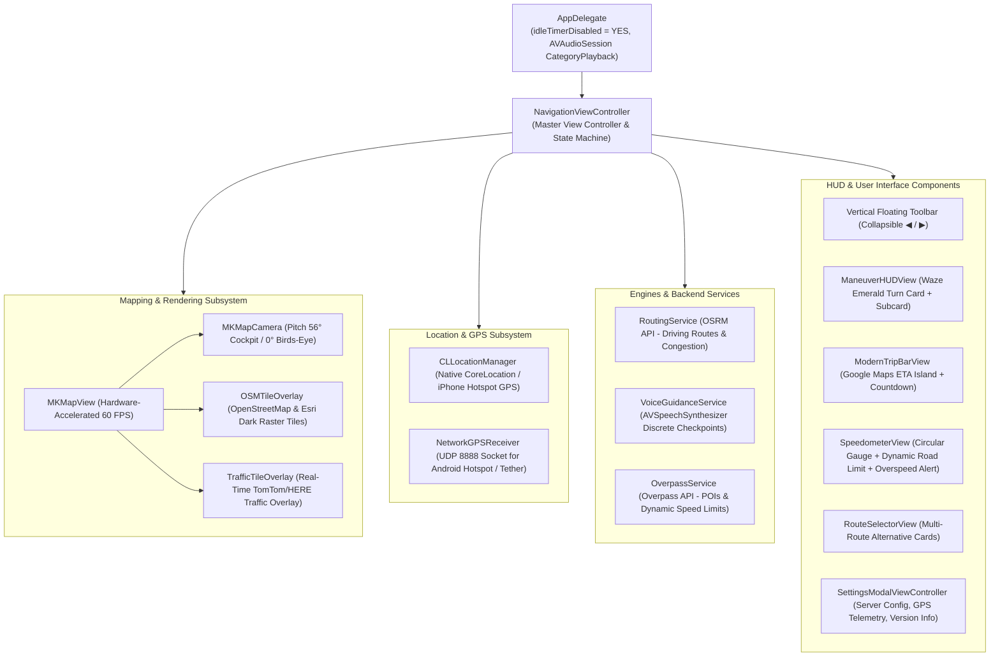

# 01 - Software Architecture & Technical Deep Dive

This document details the internal architecture, engineering trade-offs, and technical implementation of every major subsystem in **NavigatoreOSM**.

---

## 1. Why 100% Pure Native (Objective-C + MapKit + UIKit)

The 1st Generation iPad Mini (model `MD528TY/A`, identifier `iPad2,5`) is powered by an **Apple A5** SoC (dual-core 1.0 GHz ARM Cortex-A9, 32-bit `armv7`) with **512 MB of total physical RAM**, running **iOS 9.3.5 (Build 13G36)**.

### The Failure of WebKit / Browser Solutions on Legacy iOS:
1. **Immediate Jetsam Termination**: Modern WebKit engines (MobileSafari or `UIWebView` / `WKWebView`) allocate between 150 MB and 250 MB of RAM immediately upon launch. Rendering interactive vector map libraries (such as Mapbox GL JS, Leaflet, or OpenLayers) pushes memory allocation past the 200 MB threshold, prompting the iOS kernel (`jetsam`) to instantly kill the app with `EXC_RESOURCE -> Out of Memory`.
2. **Expired SSL Root Certificates**: The system trust store on iOS 9 lacks modern root certificates (e.g., *Let's Encrypt ISRG Root X1*), breaking HTTPS connections to modern tile servers and APIs inside WebKit.
3. **Severe Frame Drops**: Software-rasterized browser canvasing caps out at 15–25 FPS, resulting in severe stutter during camera rotations and zoom transitions, with no native 3D perspective pitch support.

### The Advantages of Pure Native Architecture:
- **Ultra-Lean Memory Footprint (< 25 MB RAM)**: Consuming less than 5% of total system RAM, ensuring 100% stability even after hours of continuous car navigation.
- **Hardware-Accelerated PowerVR GPU**: Native `MapKit` interacts directly with iOS OpenGL ES graphics pipelines, sustaining a silky-smooth **60 FPS** during real-time 3D perspective tilt and heading rotations.
- **Direct Hardware Control**: Prevents screen sleep (`idleTimerDisabled = YES`), enables automotive GPS navigation filtering (`CLActivityTypeAutomotiveNavigation`), and leverages offline onboard speech synthesis (`AVSpeechSynthesizer`).

---

## 2. System Architecture Diagram

---

## 3. Subsystem Breakdown & Implementation

### 3.1 Mapping Engine: `OSMTileOverlay` (`Overlays/OSMTileOverlay.h/.m`)
A custom subclass of `MKTileOverlay` designed to render raster basemaps within `MKMapView`.
- **`canReplaceMapContent = YES`**: Instructs MapKit to discard default Apple vector cartography and bypass Apple server downloads, replacing all basemap tiles with custom raster tiles.
- **Supported Cartography Modes**:
  1. `OSMMapThemeStandard`: OpenStreetMap official raster tiles (`https://tile.openstreetmap.org/{z}/{x}/{y}.png`).
  2. `OSMMapThemeDark`: Esri World Dark Gray Canvas (`https://server.arcgisonline.com/ArcGIS/rest/services/Canvas/World_Dark_Gray_Base/MapServer/tile/{z}/{y}/{x}`). No API key required, zero watermarks, high legibility for nighttime driving.
  3. `OSMMapThemeSatellite`: Apple Maps Hybrid Satellite (`MKMapTypeHybrid`) with overlaid high-contrast vector roads.
- **Persistent Disk Caching**:
  - Tiles are stored at `[NSSearchPathForDirectoriesInDomains(NSCachesDirectory, ...)]/OSMTiles/{theme}/{z}/{x}/{y}.png`.
  - Prior to issuing any HTTP request, `loadTileAtPath:result:` verifies whether the tile is already cached locally. Frequently driven regions remain fully functional **100% offline**.
- **Compliant User-Agent**: Sends the HTTP header `NavigatoreOSM/1.2.2 (iPad Mini 1; iOS 9.3.5)` in strict adherence to the OpenStreetMap Foundation Tile Usage Policy.

---

### 3.2 Real-Time Traffic Layer: `TrafficTileOverlay` (`Overlays/TrafficTileOverlay.h/.m`)
A semi-transparent raster overlay for real-time live traffic congestion.
- **`canReplaceMapContent = NO`**: Rendered at `alpha = 0.82` directly above the base street map.
- **Provider Support**: Supports TomTom Flow relative velocity overlays (`https://api.tomtom.com/traffic/map/4/tile/flow/relative0/{z}/{x}/{y}.png?key=...`). API keys can be saved persistently in `NSUserDefaults`.
- **Volatile 3-Minute Cache (TTL)**: Unlike road tiles, traffic tiles expire after 180 seconds to guarantee fresh traffic flow data.

---

### 3.3 Routing Engine: `RoutingService` (`Services/RoutingService.h/.m`)
Interacts with the Open Source Routing Machine (OSRM) HTTP API.
- **Primary Driving Endpoint**:
  `https://router.project-osrm.org/route/v1/driving/{lon1},{lat1};{lon2},{lat2}?overview=full&geometries=geojson&steps=true&alternatives=true&annotations=true`
- **Multi-Route Alternatives**: Parses up to 3 alternative paths from the `routes[]` response array, capturing distinct polyline geometries, total distances, durations, and maneuver step lists.
- **Traffic Congestion Classification**: Inspects individual segment traversal speeds (`annotation.speed` in m/s). If the proportion of segments with crawl speeds (< 15 km/h) exceeds 12%, the route is classified as `Slowdowns 🟡`; if it exceeds 30%, it is tagged as `Heavy Traffic 🔴`; otherwise it remains `Smooth Flow 🟢`.
- **Polyline Decoding**: Efficiently parses GeoJSON `[lon, lat]` coordinates into a flat C struct `CLLocationCoordinate2D[]` and constructs native `MKPolyline` overlays rendered with `MKPolylineRenderer`.

---

### 3.4 Voice Guidance: `VoiceGuidanceService` (`Services/VoiceGuidanceService.h/.m`)
Turn-by-turn offline speech synthesis.
- Utilizes `AVSpeechSynthesizer` with the native system Italian voice `[AVSpeechSynthesisVoice voiceWithLanguage:@"it-IT"]`.
- Configures `AVAudioSession` with `AVAudioSessionCategoryPlayback` and `AVAudioSessionCategoryOptionDuckOthers` (automatically lowering the volume of background car audio/music during turn announcements).
- **Discrete Checkpoint Timing**:
  Announcements fire exactly once per distance bracket to prevent repetitive chatter:
  - **1000 m**: *"In about one kilometer, [maneuver]"* (fires between 900m and 1100m).
  - **500 m**: *"In 500 meters, [maneuver]"* (fires between 420m and 580m).
  - **200 m**: *"In 200 meters, [maneuver]"* (fires between 160m and 240m).
  - **Imminent (< 35 m)**: *"Now [maneuver]"*.
- **Anti-Chatter Filter**: Enforces an 8-second minimum repeat cooldown for identical instructions.

---

### 3.5 GPS Tethering: `NetworkGPSReceiver` (`Services/NetworkGPSReceiver.h/.m`)
Solves the hardware GPS limitation on Wi-Fi-only iPads (A1432).
- Opens an asynchronous BSD UDP socket bound to port `8888` managed by Grand Central Dispatch (`dispatch_source_create(DISPATCH_SOURCE_TYPE_READ, ...)`).
- **Multi-Format Ingestion**:
  - Structured JSON: `{"lat": 45.464, "lon": 9.190, "speed": 13.5, "bearing": 90.0}`
  - CSV Format: `lat,lon,speed_kmh,bearing`
  - NMEA sentences: standard `$GPRMC` and `$GPGGA` sentences.
- Synthesizes high-precision `CLLocation` objects that feed into `MKMapView` and the navigation engine identically to an internal hardware GPS chip.

---

### 3.6 POI & Dynamic Speed Limits: `OverpassService` (`Services/OverpassService.h/.m`)
Integrates the OpenStreetMap Overpass QL API.
- **Radius-Based POI Search**: Queries OpenStreetMap nodes within a 6 km radius for fuel stations (`amenity=fuel`), parking (`amenity=parking`), cafes (`amenity=cafe`), pharmacies (`amenity=pharmacy`), or arbitrary text queries.
- **Dynamic Speed Limit Extraction**: Reverse-queries the closest highway way to the current GPS position and parses the `maxspeed` tag (e.g., `50`, `70`, `90`, `130`), automatically updating the speedometer limit badge.

---

### 3.7 Off-Route Recalculation Engine
Embedded within `NavigationViewController`:
- Calculates the perpendicular distance from the current vehicle coordinate to every line segment of the active `MKPolyline`.
- If the vehicle deviates more than **45 meters** from the active route for more than 3 consecutive GPS readings:
  1. The system announces: *"Recalculating route..."*.
  2. Cancels the existing polyline.
  3. Re-queries OSRM from the current coordinates to the active destination.
  4. Smoothly transitions the map to the newly calculated path.

---

### 3.8 HUD & UI Architecture
1. **Collapsible Vertical Toolbar**: Positioned on the right edge, collapsible via `◀`/`▶` arrow toggle. Hosts controls for Audio Mute (`🔊`/`🔇`), Map Themes (`🗺️`/`🌙`/`🛰️`), Traffic Overlay (`🚦`), Perspective View (`3D`/`2D`), and Settings (`⚙️`).
2. **`ManeuverHUDView`**: High-contrast Emerald card (`#00875A`) featuring direction arrows, distance countdown, street names, and next-turn preview subcard.
3. **`ModernTripBarView`**: Floating bottom island displaying real-time ETA, remaining travel duration, distance countdown, and a prominent red `✕` cancel button.
4. **`SpeedometerView`**: Circular gauge displaying current speed in giant 38pt digits, paired with a European standard circular speed limit sign and an animated red pulsing overspeed warning indicator.
5. **`RouteSelectorView`**: Bottom drawer presenting side-by-side alternative routes with ETA differences and live congestion tags.
6. **`SettingsModalViewController`**: Non-blocking modal for configuring custom OSRM routing servers, setting Overpass endpoints, viewing real-time GPS telemetry, and inspecting version/build metadata.
