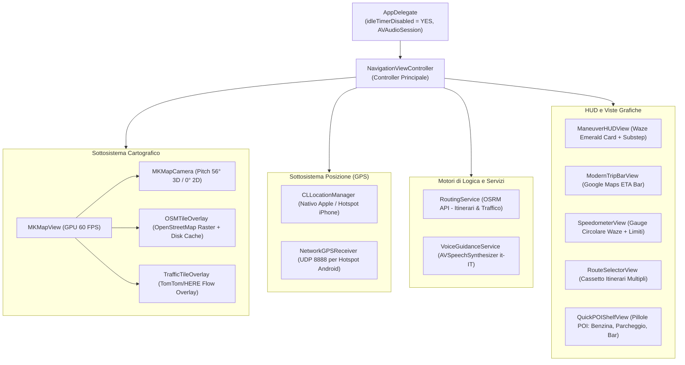

# 01 - Architettura Software e Dettaglio del Codice

Questo documento illustra l'architettura interna, le scelte ingegneristiche e il funzionamento dettagliato di ogni classe e componente di **NavigatoreOSM**.

---

## 1. Perché 100% Nativo (Objective-C + MapKit + UIKit)

L'iPad Mini 1ª Generazione (modello `MD528TY/A`) monta un chip **Apple A5** (dual-core 1.0 GHz Cortex-A9 a 32-bit `armv7`) con soli **512 MB di RAM totale** e sistema operativo **iOS 9.3.5 (13G36)**.

### I Limiti di WebKit / Browser su iOS 9:
- Una WebView (o MobileSafari) su iOS 9 alloca immediatamente 150-250 MB di RAM solo per avviare il processo WebKit. Con pochi tasselli di mappa o script complessi, il sistema operativo invoca il meccanismo di `jetsam` e killa l'app per memoria esaurita (`EXC_RESOURCE -> Out of Memory`).
- I certificati root SSL moderni (es. *Let's Encrypt ISRG Root X1*) sono scaduti nei certificati di sistema di iOS 9, causando errori di connessione HTTPS su molte sorgenti web.
- Il refresh rate nel browser non supera i 20-30 FPS e non supporta la rotazione prospettica 3D fluida.

### I Vantaggi del Nativo Puro:
- **Consumo RAM inferiore a 25 MB** (meno del 5% della RAM totale del tablet).
- **GPU Apple PowerVR SGX543MP2 sfruttata al 100%**: il framework `MapKit` invia la geometria e i tasselli direttamente alle pipeline grafiche OpenGL ES di iOS.
- **60 FPS stabili e costanti**: lo zoom, il pan e la rotazione prospettica della mappa avvengono con accelerazione hardware senza alcun lag.
- **Controllo Totale Hardware**: disabilitazione dell'autospegnimento schermo (`idleTimerDisabled = YES`), accesso diretto a `CLLocationManager` per la navigazione automobilistica (`CLActivityTypeAutomotiveNavigation`), e sintesi vocale di sistema offline (`AVSpeechSynthesizer`).

---

## 2. Diagramma di Flusso dell'Applicazione

---

## 3. Dettaglio dei Componenti e Classi

### 3.1 `OSMTileOverlay` (`Overlays/OSMTileOverlay.h/.m`)
Sottoclasse di `MKTileOverlay` per integrare OpenStreetMap in `MKMapView`.
- **`canReplaceMapContent = YES`**: indica a MapKit di non scaricare né mostrare le mappe vettoriali Apple, rimpiazzandole interamente con i tasselli OSM.
- **Sorgenti Mappe**:
  - `OSMMapThemeStandard`: `https://tile.openstreetmap.org/{z}/{x}/{y}.png`
  - `OSMMapThemeDark`: `https://a.basemaps.cartocdn.com/dark_all/{z}/{x}/{y}.png` (CartoDB Dark Matter per guida notturna)
  - `OSMMapThemeVoyager`: `https://a.basemaps.cartocdn.com/rastertiles/voyager/{z}/{x}/{y}.png`
- **Cache su Disco Permanente**:
  - Salva i file in `[NSSearchPathForDirectoriesInDomains(NSCachesDirectory, ...)]/OSMTiles/{theme}/{z}/{x}/{y}.png`.
  - In `loadTileAtPath:result:` controlla se il file esiste già su disco prima di effettuare la richiesta di rete. Le strade percorse frequentemente o le città scaricate rimangono accessibili **100% offline**.
- **User-Agent Conforme**: invia l'header `NavigatoreOSM/1.0 (iPad Mini 1; iOS 9.3.5)` rispettando la Tile Usage Policy della OpenStreetMap Foundation.

---

### 3.2 `TrafficTileOverlay` (`Overlays/TrafficTileOverlay.h/.m`)
Overlay raster semitrasparente per il traffico in tempo reale.
- **`canReplaceMapContent = NO`**: viene renderizzato con `alpha = 0.85` sopra la mappa stradale.
- **Supporto Provider**:
  - Template URL per TomTom Flow: `https://api.tomtom.com/traffic/map/4/tile/flow/relative0/{z}/{x}/{y}.png?key=...`
  - La chiave API può essere salvata in `NSUserDefaults` con la chiave `TrafficApiKey`.
- **Cache Volatile con TTL di 3 minuti**: i tasselli del traffico scadono dopo 180 secondi per garantire che le informazioni su code e rallentamenti siano sempre aggiornate.

---

### 3.3 `RoutingService` (`Services/RoutingService.h/.m`)
Interfaccia verso il motore di routing OSRM (Open Source Routing Machine).
- **Endpoint**:
  `https://router.project-osrm.org/route/v1/driving/{lon1},{lat1};{lon2},{lat2}?overview=full&geometries=geojson&steps=true&alternatives=true&annotations=true`
- **Itinerari Alternativi**: estrae fino a 3 percorsi distinti dall'array `routes[]`, ciascuno con la propria geometria e passaggi di manovra.
- **Analisi Congestione Traffico**: legge le velocità previste per ogni segmento (`annotation.speed` in m/s). Se la percentuale di segmenti a passo d'uomo (< 15 km/h) supera il 12% classifica il tragitto come `Rallentamenti 🟡`, se supera il 30% come `Traffico intenso 🔴`, altrimenti `Scorrevole 🟢`.
- **Decodifica Polyline**: converte le coordinate GeoJSON `[lon, lat]` in una struttura C `CLLocationCoordinate2D[]` e genera l'istanza `MKPolyline` nativa disegnata con `MKPolylineRenderer`.

---

### 3.4 `VoiceGuidanceService` (`Services/VoiceGuidanceService.h/.m`)
Sintesi vocale turn-by-turn offline.
- Usa `AVSpeechSynthesizer` con voce di sistema italiana `[AVSpeechSynthesisVoice voiceWithLanguage:@"it-IT"]`.
- Configura l'`AVAudioSession` su `AVAudioSessionCategoryPlayback` con opzione `AVAudioSessionCategoryOptionDuckOthers` (abbassa automaticamente eventuale musica in sottofondo durante l'annuncio vocale).
- **Temporizzazione Manovre**:
  - `> 800m`: *"Tra circa un chilometro, [manovra]"*
  - `350m - 800m`: *"Tra 500 metri, [manovra]"*
  - `150m - 350m`: *"Tra 200 metri, [manovra]"*
  - `< 35m`: *"Ora [manovra]"*
- **Filtro Anti-Eco**: impedisce di pronunciare la stessa frase più volte entro un intervallo di 8 secondi.

---

### 3.5 `NetworkGPSReceiver` (`Services/NetworkGPSReceiver.h/.m`)
Risolve l'assenza del chip GPS hardware sul modello iPad Mini Wi-Fi (A1432).
- Crea un socket BSD UDP asincrono in ascolto su porta `8888` tramite GCD `dispatch_source_create(DISPATCH_SOURCE_TYPE_READ, ...)`.
- **Parsing Formati Flessibile**:
  - JSON: `{"lat": 45.464, "lon": 9.190, "speed": 13.5, "bearing": 90.0}`
  - CSV semplice: `lat,lon,speed_kmh,bearing`
- Genera oggetti `CLLocation` sintetici ad alta precisione che alimentano la mappa e il motore di guida esattamente come se provenissero da un chip GPS interno.

---

### 3.6 `MKMapCamera` (Gestione Visuale 3D / 2D)
All'interno di `NavigationViewController.m`:
- **Modalità 3D (Cockpit View)**:
  - `camera.pitch = 56.0`: inclina il piano di visualizzazione.
  - `camera.altitude = 420.0 + (speed * 3.5)`: altezza dinamica (più veloce viaggia il veicolo, più la telecamera si alza per mostrare un raggio visivo più ampio).
  - `camera.heading = currentHeading`: rotazione coerente con la bussola o la direzione GPS.
- **Modalità 2D (Pianta Ortogonale)**:
  - `camera.pitch = 0.0`: visuale perpendicolare dall'alto (1400 metri di quota).
- Il passaggio è governato da `[self.mapView setCamera:camera animated:YES]`.

---

### 3.7 Viste Interfaccia Grafica HUD
1. **`ManeuverHUDView`**: Scheda verde smeraldo `#00875A` stile Waze con ombra 3D, freccia di svolta grande, distanza, nome via e subcard per l'anteprima della seconda svolta successiva.
2. **`ModernTripBarView`**: Barra flottante inferiore stile Google Maps con orario di arrivo ETA grande (`18:42`), minuti, km, badge traffico e pulsante rosso rapido di chiusura rotta.
3. **`SpeedometerView`**: Quadrante circolare stile Waze con velocità in cifre giganti (38 pt), cartello stradale rotondo bianco/rosso del limite (`50, 70, 90, 110, 130 km/h`) e allerta circolare rossa pulsante in caso di eccesso di velocità.
4. **`RouteSelectorView`**: Cassetto inferiore flottante per confrontare e scegliere tra i percorsi alternativi calcolati da OSRM.
5. **`QuickPOIShelfView`**: Barra a comparsa con pillole rapide per trovare con un solo tocco distributori di carburante (`⛽`), parcheggi (`🅿️`), bar/ristoro (`☕`) e farmacie (`💊`).
