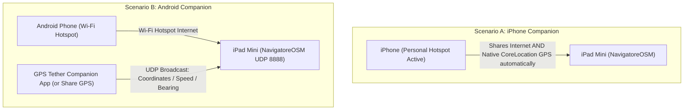

# 03 - In-Car User Manual & Feature Guide

This manual explains how to mount, power, tether, and operate **NavigatoreOSM** inside your vehicle for daily driving.

---

## 1. Physical Vehicle Setup

### 1.1 Mounting the iPad Mini
With its compact 7.9-inch display, the iPad Mini 1 is the perfect size for an in-car navigation console without obstructing your field of view:
- **Recommended Mount Types**:
  - Heavy-duty windshield suction mount positioned low against the dashboard.
  - Air-vent clamp mount or CD-slot bracket (ideal for center console positioning).
  - Custom 3D-printed dashboard bezel or magnetic ball-socket mount.
- **Orientation**: **Landscape (Horizontal)**. The entire user interface, telemetry HUD, and multi-route drawer are optimized for horizontal widescreen proportions.

### 1.2 Power Supply & Charging
Running the screen at high brightness with continuous GPU 60 FPS rendering, Wi-Fi tethering, and GPS processing requires dependable power:
- **Minimum Requirement**: A 12V cigarette lighter USB adapter supplying **at least 2.1A / 2.4A (10W to 12W)**.
- **Why Avoid 1.0A (5W) Adapters**: Standard 5W USB ports will result in the iPad slowly discharging while driving, eventually shutting down during long trips.
- Use a high-quality MFi-certified or braided Lightning cable that can sustain high charging currents without voltage drops.

---

## 2. GPS Telemetry & Connectivity for Wi-Fi Only iPads (A1432)

The 1st Gen iPad Mini Wi-Fi model does not contain an internal cellular modem or dedicated GNSS/GPS silicon. NavigatoreOSM supports two seamless tethering workflows:



### 2.1 Pairing with an iPhone (100% Plug-and-Play)
Apple iOS includes native peer-to-peer location forwarding:
1. On your iPhone, enable **Personal Hotspot** (*Settings > Personal Hotspot*).
2. Connect your iPad Mini to your iPhone's Wi-Fi hotspot.
3. **You are done!** iOS automatically forwards the iPhone's precise hardware GPS fixes to the iPad's `CLLocationManager`. NavigatoreOSM locks onto your position with zero configuration.

### 2.2 Pairing with an Android Smartphone
Android hotspots share internet connectivity but do not expose GPS coordinates at the OS level to connected Apple devices. NavigatoreOSM solves this with its built-in **`NetworkGPSReceiver`**:
1. Turn on **Wi-Fi Hotspot** on your Android smartphone and connect the iPad.
2. Note the IP address assigned to the iPad (typically `192.168.43.x`).
3. Install our companion app **`GPSTether.apk`** (available in [Releases](https://github.com/vibe-maribit/NavigatorOSM/releases)) or any free Play Store GPS forwarder (such as *Share GPS* or *GPS Tether*).
4. Configure the forwarder to stream via **UDP to the iPad's IP on port `8888`**.
5. **Testing from a PC/Mac**:
   You can also simulate driving directly from a laptop using the included Python utility:
   ```bash
   python3 android-gps-forwarder.py <IP_OF_IPAD> --simulate
   ```
   The iPad will immediately pick up the simulated telemetry, update the speedometer, and follow the mock vehicle track.

---

## 3. User Interface & Controls Overview

```
+--------------------------------------------------------------------------------+
| [ 🔍 Search Destination... ]                                              [ ◀ ]|
| [ ⛽ Fuel ]  [ 🅿️ Parking ]  [ ☕ Cafe ]  [ 💊 Pharmacy ]                   [ 🔊 ]|
|                                                                           [ 🗺️ ]|
|                                                                           [ 🚦 ]|
|                                                                           [ 3D ]|
|                         MAPKIT HARDWARE VIEW                              [ ⚙️ ]|
|                           (60 FPS OpenGL)                                      |
|                                                                                |
|    ( 84 )                                                                      |
|    KM/H                                                                        |
|    [ 90 ]                                                                      |
|                                                                                |
|   +-----------------------------------------------------------------------+    |
|   | 18:42 ETA  •  24 min  •  16.2 km  •  🟢 Smooth Flow               [ ✕ ]|    |
|   +-----------------------------------------------------------------------+    |
+--------------------------------------------------------------------------------+
```

### 3.1 Collapsible Vertical Toolbar (`◀` / `▶`)
Docked cleanly on the right-hand edge to avoid obscuring map details:
- **Collapse Toggle (`◀` / `▶`)**: Tap to collapse the toolbar into a compact pill, maximizing map visibility.
- **Audio Guidance (`🔊` / `🔇`)**: Toggle spoken voice guidance on or off instantly.
- **Map Cartography (`🗺️`)**: Cycle through 3 high-performance display modes:
  1. `Standard OSM`: Clean, familiar OpenStreetMap day tiles.
  2. `Esri Dark Canvas`: High-contrast dark theme designed to minimize glare during night driving.
  3. `Apple Satellite Hybrid`: Real-world aerial photography combined with vector road labels.
- **Live Traffic Flow (`🚦`)**: Enable or disable the semi-transparent real-time traffic overlay.
- **Perspective Toggle (`3D` / `2D`)**:
  - `3D (Cockpit View)`: 56° dynamic camera pitch with auto-altitude scaling based on vehicle speed.
  - `2D (Birds-Eye)`: Flat 0° orthographic overview for regional orientation.
- **Settings Modal (`⚙️`)**: Opens the settings drawer to configure routing servers, Overpass URLs, and inspect GPS telemetry.

---

### 3.2 Turn-by-Turn Maneuver HUD (Waze Style)
When a route is active, the top-left card displays guidance:
- **Turn Icon**: High-contrast directional glyph (`↱`, `↰`, `↑`, `🔄`).
- **Distance Countdown**: Bold, large-format remaining distance to the maneuver.
- **Street Name**: Target road or highway exit.
- **Next Maneuver Subcard**: Displays the subsequent turn when two maneuvers occur in rapid succession.
- **Spoken Repeat**: Tap anywhere on the maneuver card to replay the voice announcement.

---

### 3.3 Modern Trip Bar (Google Maps Style)
The bottom floating card provides critical trip stats at a glance:
- **Exact ETA**: Calculated against current system time (e.g., `18:42`).
- **Dynamic Countdown**: Real-time remaining travel time and kilometers (`24 min • 16.2 km`).
- **Traffic Indicator**: Live congestion badge (`🟢 Smooth Flow`, `🟡 Slowdowns`, `🔴 Heavy Traffic`).
- **End Route Button (`✕`)**: Instantly cancels navigation, wipes polylines from the map, and returns to free-driving mode.

---

### 3.4 Speedometer & Dynamic Speed Limits
Located in the bottom-left corner:
- **Digital Gauge**: Displays live vehicle speed in 38pt high-legibility digits.
- **Speed Limit Badge**: Shows the applicable road speed limit. Automatically retrieved from OpenStreetMap `maxspeed` tags via Overpass API, or manually cycled by tapping the badge (`Off`, `50`, `70`, `90`, `110`, `130 km/h`).
- **Pulsing Overspeed Warning**: If vehicle speed exceeds the limit by more than 2 km/h, the circular gauge flashes bright red and displays a prominent **"OVERSPEED!"** warning.

---

### 3.5 Quick POI Shelf & Search History
- **One-Tap Amenities**: Tap `⛽ Fuel`, `🅿️ Parking`, `☕ Cafe`, or `💊 Pharmacy` to query OpenStreetMap for nearby services within 6 km. POIs appear as interactive pins with distance and one-tap routing.
- **Recent Destinations**: Tap the search bar to reveal recent destination history for instant re-routing to frequent stops.

---

### 3.6 Automatic Off-Route Recalculation
If you miss a turn or take an alternate road, NavigatoreOSM calculates your perpendicular deviation. Once you are more than 45 meters off-track, the system announces *"Recalculating route..."* and seamlessly provisions an updated itinerary without requiring driver interaction.
