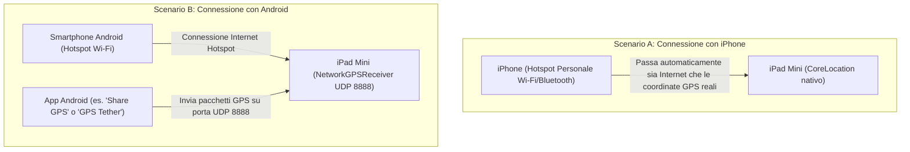

# 03 - Manuale d'Uso in Auto e Guida alle Funzionalità

Questo manuale illustra come configurare, alimentare e utilizzare l'applicazione **NavigatoreOSM** all'interno del tuo veicolo.

---

## 1. Setup Fisico nel Veicolo

### 1.1 Supporto Tablet per Auto
L'iPad Mini ha un display da 7.9 pollici ideale per la plancia:
- **Posizionamento ideale**: supporto a ventosa sul parabrezza (abbastanza in basso da non ostruire la visuale stradale) o supporto per bocchetta dell'aria / slot CD.
- **Orientamento consigliato**: **Orizzontale (Landscape)**. L'interfaccia è studiata per sfruttare al meglio l'ampiezza orizzontale del display.

### 1.2 Alimentazione
- Tenere lo schermo dell'iPad sempre acceso con la GPU e il Wi-Fi attivi richiede un'alimentazione costante.
- Usa un alimentatore da presa accendisigari da **almeno 2.1A / 2.4A (10W - 12W)** con un buon cavo Lightning. Se usi caricatori vecchi da 1A (5W), la batteria potrebbe scaricarsi lentamente anche se collegata.

---

## 2. Gestione Connessione Dati e GPS per iPad Solo Wi-Fi (A1432)

L'iPad Mini 1 (modello `MD528TY/A`) è la versione **solo Wi-Fi** e non include un modem telefonico né un chip GPS hardware dedicato. 
Per farlo funzionare da navigatore in auto abbiamo previsto due modalità:



### 2.1 Connessione con iPhone (100% Automatica)
Se possiedi un iPhone:
1. Attiva **Hotspot personale** sull'iPhone (*Impostazioni > Hotspot personale*).
2. Connetti l'iPad Mini alla rete Wi-Fi dell'iPhone.
3. **Fatto!** iOS condivide in modo trasparente e continuo le coordinate satellitari ad alta precisione del GPS dell'iPhone all'iPad. L'app utilizzerà automaticamente `CLLocationManager` senza alcuna configurazione aggiuntiva.

### 2.2 Connessione con Smartphone Android o PC
Gli hotspot Android condividono la connessione dati a internet ma non trasmettono le coordinate GPS a livello di sistema a iOS. Per questo abbiamo integrato nel codice il componente **`NetworkGPSReceiver`**:
1. Connetti l'iPad Mini all'hotspot Wi-Fi del tuo telefono Android.
2. Controlla l'indirizzo IP assegnato all'iPad sull'hotspot (in genere `192.168.43.x`).
3. Sul telefono Android, installa una qualsiasi app gratuita di inoltro GPS (es. *Share GPS*, *GPS Tether* o *BlueNMEA*) impostando la trasmissione via UDP verso l'IP dell'iPad sulla porta **`8888`**.
4. **Test dal Computer**: Nella cartella del progetto trovi anche lo script Python `android-gps-forwarder.py`:
   ```bash
   python3 android-gps-forwarder.py <IP_IPAD> --simulate
   ```
   L'iPad aggancerà immediatamente il segnale mostrando sul tachimetro la velocità e posizionando il veicolo sulla mappa!

---

## 3. Guida all'Interfaccia Utente

```
+-----------------------------------------------------------------------+
| [ 🔍 Cerca destinazione... ]                                          |
| [ ⛽ Benzina ]  [ 🅿️ Parcheggio ]  [ ☕ Bar ]  [ 💊 Farmacie ]          |
|                                                                       |
|                                                                       |
|                            MAPPA OPENSTREETMAP                        |
|                               (Visuale 3D)                            |
|                                                                       |
|                                                                       |
|   ( 84 )                      [ 🔊 ]  [ 🌙 ]  [ 🚦 ]  [ 3D/2D ] [ 🎯 ] |
|   KM/H                                                                |
+-----------------------------------------------------------------------+
```

### 3.1 Visuale 3D / 2D Commutabile (`3D / 2D`)
- **Pulsante `3D/2D` (in basso a destra)**:
  - **Modalità 3D (Cockpit View)**: La telecamera si inclina a 56° di pitch offrendo la classica prospettiva profonda in direzione di marcia. La quota visiva si allontana automaticamente all'aumentare della velocità.
  - **Modalità 2D (Pianta Ortogonale)**: La telecamera torna a 0° a volo d'uccello a 1400 metri di quota per una visione panoramica d'insieme.

### 3.2 Scheda Manovre Verde Smeraldo (Stile Waze)
Quando la navigazione è attiva, in alto a sinistra compare la scheda di guida:
- **Freccia grafica grande** ad alto contrasto per la direzione da prendere (`↱`, `↰`, `↑`, `🔄`).
- **Distanza alla manovra** in caratteri cubitali (`350 m`).
- **Nome della strada** evidenziato in bianco.
- **Subcard Anteprima Successiva**: se ci sono due svolte ravvicinate, la subcard inferiore anticipa la mossa successiva (*"Poi ↰ su Viale Tibaldi"*).
- **Ripeti Voce**: tocca la scheda per farti rispiegare la manovra con la voce guida italiana.

### 3.3 Barra di Viaggio Inferiore (Stile Google Maps)
In basso compare l'isola flottante con i dati di arrivo:
- **Orario di arrivo esatto ETA** calcolato sull'orologio di sistema (`Arrivo: 18:42`).
- **Minuti e chilometri mancanti** (`24 min • 16.2 km`).
- **Indicatore live del traffico** (`🟢 Traffico regolare`, `🟡 Rallentamenti`, etc.).
- **Tasto rosso `✕`**: tocca per annullare la rotta e tornare alla modalità libera.

### 3.4 Tachimetro Circolare e Allerta Limiti di Velocità
- In basso a sinistra trovi il quadrante circolare della velocità reale in km/h.
- **Regolazione Limite**: tocca il tachimetro per ciclare le soglie (`Off`, `50`, `70`, `90`, `110`, `130 km/h`). Sul quadrante comparirà il cartello stradale bianco e rosso con il numero.
- **Allarme Visivo di Eccesso**: se superi la velocità impostata di oltre 2 km/h, l'intera corona circolare si accende di **rosso vivo pulsante** e compare l'avviso giallo **"ECCESSO!"**.

### 3.5 Layer Traffico in Tempo Reale (`🚦`)
- Tocca il pulsante circolare con il semaforo `🚦` in basso a destra per attivare o disattivare istantaneamente il layer semitrasparente del flusso di traffico stradale.

### 3.6 Ricerca Rapida POI (`[⛽ Benzina]`, `[🅿️ Parcheggio]`, `[☕ Bar]`, `[💊 Farmacie]`)
- In alto trovi le pillole rapide. Toccando una pillola (es. `⛽ Benzina`), l'app cerca i distributori nel raggio di 6 km e piazza le spille blu sulla mappa.
- Tocca una spilla per visualizzare nome e distanza, e tocca la freccia per impostarla subito come destinazione!

### 3.7 Ricalcolo Automatico Fuori Rotta
- Se perdi un'uscita o svolti in una via diversa, l'app se ne accorge in pochi metri. La voce annuncia *"Ricalcolo del percorso in corso..."* e aggiorna la rotta dalla tua posizione corrente senza bisogno di toccare l'iPad.

### 3.8 Modalità Giorno / Notte (`🌙 / ☀️`)
- Tocca il pulsante con la luna per passare istantaneamente dalla cartografia chiara standard di OpenStreetMap al tema scuro **CartoDB Dark Matter**, perfetto per guidare di notte senza abbagliare il conducente.
